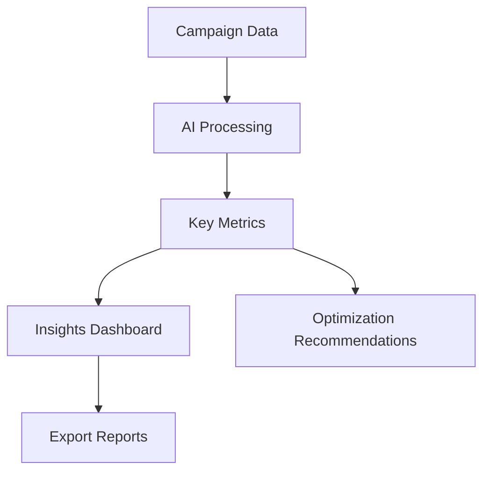

## Overview

AdsTurbo empowers you to create high-converting ad creatives using AI-driven tools. You access core features like AI ad generation, campaign optimization, and data-driven insights. These capabilities help you maximize ROI by crafting resonant ad content for your audience.

<Columns cols={3}>
  <Card title="AI Ad Generation" icon="zap" href="/docs/ad-generation">
    Generate compelling ads instantly with AI.
  </Card>
  <Card title="Campaign Optimization" icon="trending-up" href="/docs/optimization">
    Fine-tune campaigns for peak performance.
  </Card>
  <Card title="Insights & Analytics" icon="bar-chart-3" href="/docs/analytics">
    Unlock data-driven decisions.
  </Card>
</Columns>

## AI-Driven Ad Generation

You use AdsTurbo's AI to produce ad copy, images, and videos tailored to your brand. Input your product details, target audience, and goals. The AI generates multiple variants optimized for platforms like Google Ads or Meta.

<Callout kind="tip">
  Start with clear prompts including keywords and tone for best results.
</Callout>

<Steps>
  <Step title="Define Campaign" icon="target">
    Specify audience demographics and objectives.

    ```javascript
    const campaign = {
      audience: { age: "25-34", interests: ["fitness"] },
      goal: "conversions"
    };
    ```
  </Step>
  <Step title="Generate Creatives" icon="sparkles">
    Call the AI generation API.

    <CodeGroup tabs="JavaScript,Python">
      ```javascript
      const response = await fetch('https://api.adsturbo.com/v1/generate', {
        method: 'POST',
        headers: { 'Authorization': 'Bearer YOUR_API_KEY' },
        body: JSON.stringify({
          prompt: 'Create fitness ad for yoga mats',
          format: 'image-text'
        })
      });
      ```
      ```python
      import requests
      response = requests.post('https://api.adsturbo.com/v1/generate',
        headers={'Authorization': 'Bearer YOUR_API_KEY'},
        json={'prompt': 'Create fitness ad for yoga mats', 'format': 'image-text'})
      ```
    </CodeGroup>
  </Step>
  <Step title="Review & Select" icon="check-circle">
    Preview variants and select top performers.
  </Step>
</Steps>

## Campaign Optimization Techniques

Optimize your campaigns using automated rules and machine learning. AdsTurbo analyzes performance data to adjust bids, targeting, and creatives in real-time.

<Tabs>
  <Tab title="Auto-Bidding" icon="dollar-sign">
    Enable smart bidding to maximize conversions within budget.

    | Strategy | Use Case | Expected Lift |
    |----------|----------|---------------|
    | Target CPA | E-commerce | `>20%` ROI |
    | Maximize Clicks | Awareness | `+30%` traffic |
    | ROAS Target | High-value sales | `2x` return |
  </Tab>
  <Tab title="A/B Testing" icon="split">
    Test ad variants systematically.

    ```javascript
    const testConfig = {
      variants: ['ad1', 'ad2', 'ad3'],
      metric: 'ctr',
      duration: '7d'
    };
    ```
  </Tab>
</Tabs>

<Expandable title="Advanced Optimization Rules" default-open="false">

Set custom rules for pausing underperformers.

```javascript
const rules = [
  { condition: 'ctr < 1%', action: 'pause' },
  { condition: 'cpc > $2', action: 'reduce-bid' }
];
```

</Expandable>

## Data-Driven Insights and Analytics

Access comprehensive dashboards for performance metrics. Track key indicators like CTR, CPC, and conversion rates. Use AI-powered anomaly detection to spot issues early.



<Callout kind="info">
  Integrate with tools like Google Analytics for holistic views.
</Callout>

<ParamField path="campaignId" param-type="string" required="true">
  Unique campaign identifier.
</ParamField>

<ResponseField name="ctr" field-type="number">
  Click-through rate as percentage.
</ResponseField>

These concepts form the foundation of AdsTurbo. Experiment with AI generation first to see immediate impact on your campaigns.