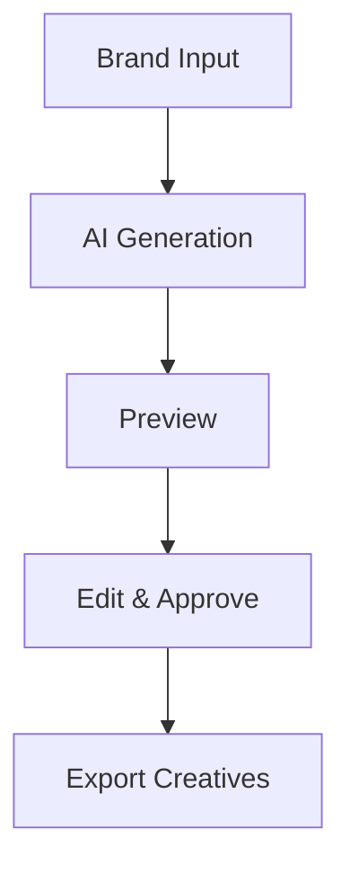

## Overview

AdsTurbo equips you with AI-powered tools to create, target, and optimize ad campaigns. You design compelling creatives, select precise audiences, and monitor performance in real-time. Follow these sections to launch high-ROI campaigns.

<Columns cols={3}>
  <Card title="Design Creatives" icon="image" href="#designing-compelling-ad-creatives">
    Build visually engaging ads with AI assistance.
  </Card>
  <Card title="Target Audiences" icon="users" href="#audience-targeting-strategies">
    Reach the right people with advanced segmentation.
  </Card>
  <Card title="Monitor Performance" icon="bar-chart-3" href="#performance-monitoring-and-adjustments">
    Track metrics and refine for better results.
  </Card>
</Columns>

## Designing Compelling Ad Creatives

Start by accessing the Creative Studio in your AdsTurbo dashboard. You input brand details and let AI generate variations.

<Steps>
  <Step title="Set Brand Guidelines" icon="settings">
    Upload your logo and define tone: professional, fun, or urgent.

    ```json
    {
      "brand": {
        "logo": "https://your-brand.com/logo.png",
        "colors": ["#8c5cf4", "#ffffff"],
        "tone": "energetic"
      }
    }
    ```
  </Step>
  <Step title="Generate Variants" icon="zap">
    Click "Generate" to create 10 headline-body pairs.

    <Callout kind="tip">
      Select aspect ratios like `1:1` for Instagram or `9:16` for Stories.
    </Callout>
  </Step>
  <Step title="Preview and Edit" icon="edit-3">
    Review on device previews and tweak text or images manually.
  </Step>
</Steps>



<Expandable title="Advanced Customization" default-open="false">
  Use custom prompts for niche industries:

  ```javascript
  const prompt = {
    industry: "ecommerce",
    goal: "drive sales",
    audience: "millennials"
  };
  ```
</Expandable>

## Audience Targeting Strategies

Tailor your reach with layered targeting. Combine demographics, interests, and behaviors.

<Tabs>
  <Tab title="Demographic" icon="user">
    Target by age, gender, location.

    | Criterion | Options | Example |
    |-----------|---------|---------|
    | Age      | 18-24, 25-34 | Young professionals |
    | Location | Cities, countries | New York, USA |
    | Income   | High, medium | `{>50k}` annually |
  </Tab>
  <Tab title="Behavioral" icon="activity">
    Reach based on actions like past purchases.

    <CodeGroup tabs="API,Dashboard">
      ```javascript
      const targeting = {
        behaviors: ["recent_purchases", "cart_abandoners"],
        minEvents: 5
      };
      await adsTurbo.setTargeting(targeting);
      ```
      ```bash
      # Dashboard: Audiences > Behaviors > Select filters
      curl -X POST /api/targeting \
        -d '{"behaviors": ["purchases"]}'
      ```
    </CodeGroup>
  </Tab>
  <Tab title="Lookalike" icon="users">
    Expand reach with AI-simulated audiences from your converters.

    <Callout kind="success">
      Lookalikes boost ROI by `{30-50%}` on average.
    </Callout>
  </Tab>
</Tabs>

## Performance Monitoring and Adjustments

Launch your campaign and track key metrics: CTR, conversion rate, ROAS.

<Columns cols={2}>
  <Card title="Key Metrics" icon="trending-up">
    - CTR: `{>2%}` target
    - ROAS: `{4x}` minimum
    - CPC: Monitor daily spend
  </Card>
  <Card title="Optimization Rules" icon="sliders">
    Auto-pause underperformers; scale winners.
  </Card>
</Columns>

Set up alerts and rules:

<Steps>
  <Step title="View Dashboard" icon="layout-dashboard">
    Navigate to Campaigns > Analytics.
  </Step>
  <Step title="Set Rules" icon="alert-triangle">
    Create rule: "Pause if CTR `{<1%}` after 100 impressions."
  </Step>
  <Step title="A/B Test" icon="git-branch">
    Run variants and promote the best performer.
  </Step>
</Steps>

Regular reviews ensure sustained performance. Adjust bids weekly based on data.