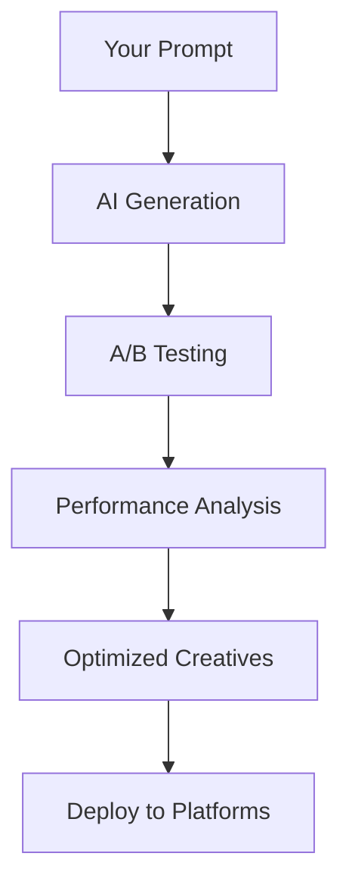

## Overview

AdsTurbo empowers you to create high-converting ad creatives using AI-driven solutions. You generate compelling ads tailored to your audience, optimize campaigns for maximum ROI, and gain data-driven insights that boost conversions and brand visibility. Whether you run e-commerce stores or SaaS products, AdsTurbo simplifies ad creation while delivering measurable results.

<Callout kind="info">
  AdsTurbo integrates seamlessly with platforms like Google Ads, Meta, and TikTok, automating creative generation and A/B testing.
</Callout>

## Key Features

Explore the core capabilities that make AdsTurbo stand out.

<Columns cols={3}>
  <Card title="AI Creative Generation" icon="zap" href="/docs/creative-generation">
    Generate ad copy, images, and videos in seconds using natural language prompts.
  </Card>
  <Card title="Performance Optimization" icon="trending-up" href="/docs/optimization">
    Automatically test variations and select winners based on real-time data.
  </Card>
  <Card title="Audience Insights" icon="users" href="/docs/insights">
    Analyze target demographics to refine messaging and improve engagement.
  </Card>
</Columns>

## Benefits and Use Cases

AdsTurbo delivers tangible benefits across industries. Choose your scenario to see tailored examples.

<Tabs>
  <Tab title="E-commerce" icon="shopping-cart">
    Boost product sales with personalized ad creatives. For example, generate Facebook carousel ads highlighting top sellers.
    
    ```javascript
    const ad = await adsTurbo.generate({
      prompt: "Create carousel ad for running shoes targeting fitness enthusiasts",
      platform: "facebook",
      format: "carousel"
    });
    console.log(ad.creatives);
    ```
  </Tab>
  <Tab title="SaaS" icon="code">
    Drive sign-ups with targeted LinkedIn ads. Optimize for click-through rates exceeding `>2%`.
    
    ```javascript
    const campaign = await adsTurbo.optimize({
      goal: "signups",
      budget: 1000,
      audience: "developers"
    });
    ```
  </Tab>
  <Tab title="Local Business" icon="map-pin">
    Attract foot traffic with Google Local Services ads. Use geo-targeted creatives for immediate impact.
    
    ```javascript
    const localAd = await adsTurbo.create({
      type: "local",
      location: "New York",
      service: "plumbing"
    });
    ```
  </Tab>
</Tabs>

## How AI Drives Ad Success

AdsTurbo's AI workflow transforms your inputs into optimized ads. Review this simple process flow:



<Expandable title="Advanced AI Features" default-open="false">
  Leverage fine-tuning for brand voice consistency and multi-language support. Integrate custom models via `{API_KEY}` for proprietary data.
</Expandable>

## Quick Start

Get up and running in minutes.

<Steps>
  <Step title="Sign Up" icon="user-plus">
    Create your account at [app.adsturbo.com](https://app.adsturbo.com) and obtain your `{API_KEY}`.
  </Step>
  <Step title="Install SDK" icon="download">
    <CodeGroup tabs="npm,yarn">
      ```bash
      npm install adsturbo-sdk
      ```
      ```bash
      yarn add adsturbo-sdk
      ```
    </CodeGroup>
  </Step>
  <Step title="Generate First Ad" icon="rocket">
    Initialize and create your first creative.
    
    ```javascript
    import { AdsTurbo } from 'adsturbo-sdk';
    
    const client = new AdsTurbo({ apiKey: 'YOUR_API_KEY' });
    const creative = await client.creatives.generate({
      prompt: 'Engaging ad for coffee subscription service'
    });
    console.log(creative.url);
    ```
  </Step>
</Steps>

<Callout kind="tip">
  Start with simple prompts for best results. Experiment with specifics like tone (`{funny}` or `{professional}`) to match your brand.
</Callout>