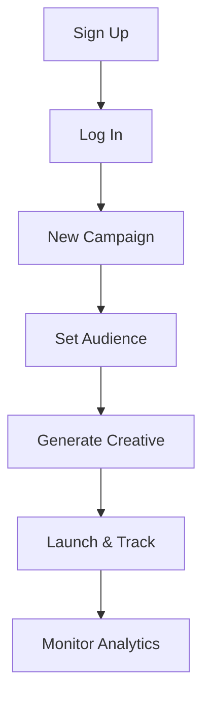

## Get Started with AdsTurbo

AdsTurbo streamlines ad creation with AI-powered tools. Follow these steps to create an account, explore the dashboard, and launch your first campaign. You complete setup in under 10 minutes.

<Callout kind="tip">
Prepare your brand assets like logos and target audience details before starting. This speeds up creative generation.
</Callout>

## Step 1: Create Account and Log In

Sign up for AdsTurbo to access the dashboard. Use your business email for verification.

<Steps>
  <Step title="Visit Signup Page" icon="external-link">
    Go to `https://app.adsturbo.com/signup`.
  </Step>
  <Step title="Enter Details" icon="user">
    Provide your email, create a strong password, and select your industry (e.g., e-commerce).
  </Step>
  <Step title="Verify Email" icon="mail">
    Check your inbox for the verification link and click it.
  </Step>
  <Step title="Log In" icon="log-in">
    Return to `https://app.adsturbo.com/login` and sign in with your credentials.
  </Step>
</Steps>

## Step 2: Explore the Dashboard

The dashboard centralizes your campaigns, analytics, and creatives. Key sections help you manage everything efficiently.

<Columns cols={3}>
  <Card title="Campaigns" icon="trending-up" href="/docs/campaigns">
    View active campaigns, performance metrics, and optimization suggestions.
  </Card>
  <Card title="Creatives" icon="image" href="/docs/creatives">
    Generate and edit AI-powered ad visuals and copy.
  </Card>
  <Card title="Analytics" icon="bar-chart-3" href="/docs/analytics">
    Track ROI, conversions, and audience insights.
  </Card>
</Columns>

## Step 3: Create Your First Ad Campaign

Build a basic campaign targeting e-commerce users. AdsTurbo's AI generates optimized creatives.

<Tabs>
  <Tab title="Select Objective" icon="target">
    From the dashboard, click **New Campaign**. Choose `Conversion` as your objective.
  </Tab>
  <Tab title="Define Audience" icon="users">
    Set demographics: age `25-45`, interests `online shopping`. Upload customer data for lookalikes.
  </Tab>
  <Tab title="Generate Creative" icon="zap">
    Enter headline prompt: `Boost sales with 50% off`. AI creates variations.
  </Tab>
</Tabs>

<Steps>
  <Step title="Review and Launch" icon="play">
    Preview creatives. Set budget to `$100/day`. Click **Launch**.
  </Step>
  <Step title="Add Tracking" icon="code">
    Integrate with your site using this snippet:

    <CodeGroup tabs="JavaScript,HTML">
```javascript
// Add to your site header
window.adsTurbo = { campaignId: 'your-campaign-id' };
(function() {
  const script = document.createElement('script');
  script.src = 'https://sdk.adsturbo.com/tracker.js';
  document.head.appendChild(script);
})();
```
```html
<!-- Paste in <head> -->
<script>
  window.adsTurbo = { campaignId: 'your-campaign-id' };
</script>
<script src="https://sdk.adsturbo.com/tracker.js"></script>
```
    </CodeGroup>
  </Step>
</Steps>



## Next Steps

<Expandable title="Troubleshooting Common Issues" default-open="false">
- **Login fails?** Reset password via `https://app.adsturbo.com/reset`.
- **Creatives not generating?** Check API key in settings (`YOUR_API_KEY`).
</Expandable>

Monitor your campaign in Analytics. Optimize based on click-through rates `{CTR > 2%}` targets. Explore advanced features next.